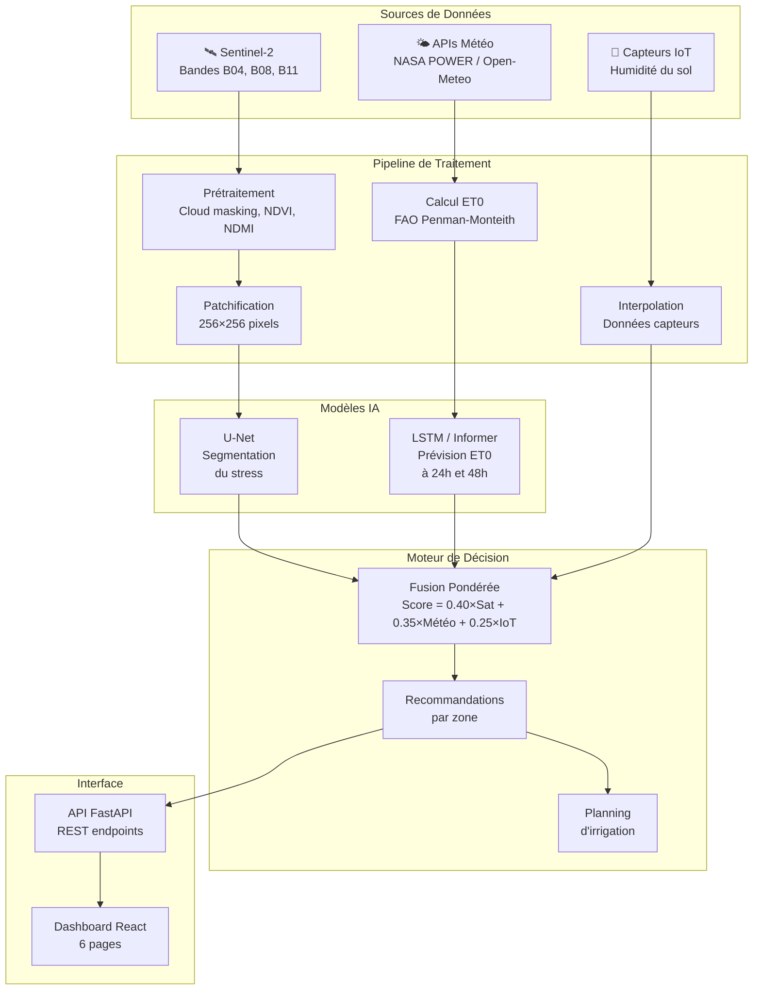
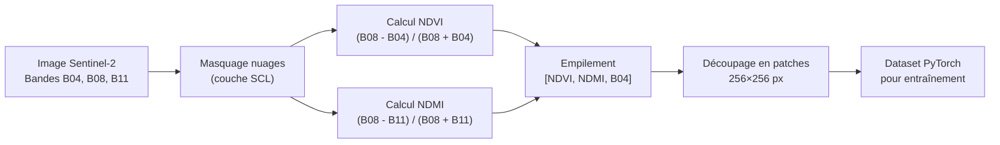
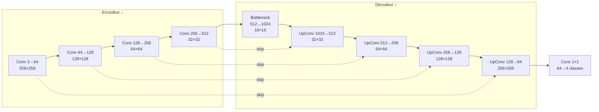
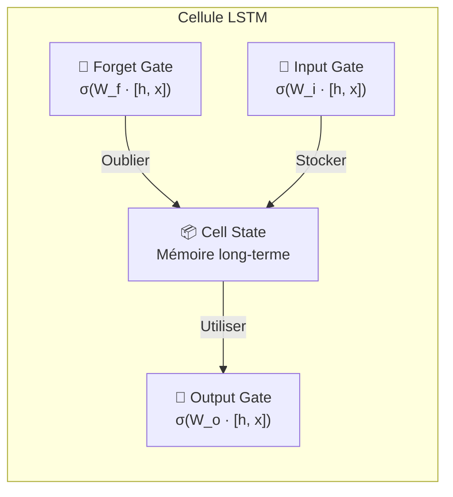

# 📄 Documentation Complète du Projet
# Système d'Irrigation de Précision par Intelligence Artificielle
### Thème : Agriculture & Stress Hydrique — Maroc

---

## Table des Matières

1. [Vue d'ensemble du projet](#1-vue-densemble)
2. [Architecture du système](#2-architecture)
3. [Pipeline de données](#3-pipeline-de-données)
4. [Modèles d'Intelligence Artificielle](#4-modèles-ia)
5. [Moteur de Fusion & Décision](#5-moteur-de-fusion)
6. [Dashboard & Interface Utilisateur](#6-dashboard)
7. [Régions Agricoles du Maroc](#7-régions)
8. [Comment exécuter le projet](#8-exécution)
9. [Points clés pour la présentation](#9-présentation)

---

## 1. Vue d'ensemble

### 1.1 Problématique

Le Maroc fait face à un **stress hydrique croissant** dû au changement climatique. L'agriculture consomme **80% des ressources en eau** du pays, mais l'irrigation traditionnelle (uniforme) gaspille entre **30 et 50%** de l'eau en arrosant des zones qui n'en ont pas besoin.

### 1.2 Solution Proposée

Nous avons développé un **Système d'Irrigation de Précision** basé sur l'IA qui combine **trois sources de données** pour recommander des volumes d'irrigation **zone par zone** :

| Source | Technologie | Rôle |
|--------|------------|------|
| 🛰️ **Satellite** | Sentinel-2 (Copernicus) | Détecter le stress végétal via NDVI/NDMI |
| 🌤️ **Météo** | NASA POWER / Open-Meteo | Prévoir l'évapotranspiration (ET0) à 48h |
| 📡 **Capteurs IoT** | Sondes d'humidité du sol | Mesurer l'humidité en temps réel |

### 1.3 Résultat

Le système produit :
- Une **carte de stress hydrique** pixel par pixel
- Une **prévision météo à 48h** avec calcul d'ET0
- Des **recommandations d'irrigation ciblées** par zone
- Un **planning horaire** d'irrigation optimisé
- Des **économies d'eau de 13–30%** par rapport à l'irrigation uniforme

### 1.4 Stack Technologique

| Composant | Technologies |
|-----------|-------------|
| **Backend API** | Python, FastAPI, Uvicorn |
| **Frontend** | React 18, Vite, Recharts, Leaflet |
| **IA — Segmentation** | PyTorch, U-Net, Vision Transformer |
| **IA — Prévision** | PyTorch, LSTM, Informer (Transformer) |
| **Données satellite** | Copernicus Data Space, Sentinel-2 L2A |
| **Données météo** | NASA POWER API, Open-Meteo API |
| **Capteurs IoT** | Simulateur réaliste (extensible MQTT) |

---

## 2. Architecture

### 2.1 Architecture Globale



### 2.2 Structure des Fichiers

```
Theme Agriculture & Stress Hydrique/
├── api/
│   └── server.py              ← API FastAPI (12 endpoints)
├── config/
│   └── settings.py            ← Configuration globale + 12 régions
├── pipeline/
│   ├── satellite.py           ← Acquisition Sentinel-2 + prétraitement
│   ├── weather.py             ← Données météo + calcul ET0
│   ├── indices.py             ← NDVI, NDMI, classification stress
│   ├── iot.py                 ← Simulateur capteurs IoT
│   └── fusion.py              ← Moteur de décision d'irrigation
├── models/
│   ├── unet/
│   │   ├── model.py           ← U-Net + AttentionGate + ViT
│   │   ├── train.py           ← Script d'entraînement U-Net
│   │   └── dataset.py         ← Dataset PyTorch satellite
│   └── timeseries/
│       ├── model.py           ← LSTM + GRU + Informer
│       ├── train.py           ← Script d'entraînement LSTM/Informer
│       └── dataset.py         ← Dataset séries temporelles
├── demo/
│   └── generate_synthetic.py  ← Génération de données synthétiques
├── frontend/
│   └── src/
│       ├── App.jsx            ← Composant principal + région selector
│       ├── App.css            ← Styles premium dark theme
│       ├── components/
│       │   └── Sidebar.jsx    ← Barre de navigation
│       └── pages/
│           ├── HomePage.jsx        ← Tableau de bord (command center)
│           ├── MapPage.jsx         ← Carte interactive Leaflet
│           ├── StressPage.jsx      ← Analyse stress hydrique
│           ├── ForecastPage.jsx    ← Météo & prévisions
│           ├── RecommendationsPage.jsx ← Plan d'irrigation
│           └── ReportPage.jsx      ← Rapport imprimable
└── requirements.txt
```

---

## 3. Pipeline de Données

### 3.1 Données Satellite — Sentinel-2

> [!IMPORTANT]
> Sentinel-2 est un satellite de l'Agence Spatiale Européenne (ESA) qui fournit des images multispectrales gratuites à **10 mètres de résolution** tous les **5 jours**.

#### Bandes utilisées

| Bande | Nom | Longueur d'onde | Résolution | Usage |
|-------|-----|-----------------|------------|-------|
| **B04** | Rouge | 665 nm | 10 m | Absorption chlorophylle |
| **B08** | NIR (Proche infrarouge) | 842 nm | 10 m | Réflectance végétation |
| **B11** | SWIR (Infrarouge court) | 1610 nm | 20 m | Contenu en eau |

#### Pipeline de prétraitement (satellite.py)



#### Masquage des nuages

Le **Scene Classification Layer (SCL)** de Sentinel-2 L2A identifie automatiquement les pixels nuageux :

```python
# Valeurs SCL masquées :
# 3 = Ombre de nuage
# 8 = Nuage (probabilité moyenne)  
# 9 = Nuage (haute probabilité)
# 10 = Cirrus fin
cloud_mask = np.isin(scl, [3, 8, 9, 10])
data[cloud_mask] = NaN
```

#### Authentification Copernicus

```python
# L'accès aux données Sentinel-2 se fait via l'API OData
# de Copernicus Data Space Ecosystem
POST https://identity.dataspace.copernicus.eu/.../token
  → Token d'accès OIDC

GET https://catalogue.dataspace.copernicus.eu/odata/v1/Products
  → Recherche par zone, date, couverture nuageuse (<20%)
```

### 3.2 Indices de Végétation

#### NDVI — Normalized Difference Vegetation Index

$$\text{NDVI} = \frac{NIR - Rouge}{NIR + Rouge}$$

| Valeur NDVI | Interprétation | Niveau de stress |
|-------------|---------------|-----------------|
| **> 0.5** | Végétation dense et saine | ✅ Normal |
| **0.3 – 0.5** | Végétation modérée | ⚠️ Stress léger |
| **0.2 – 0.3** | Végétation dégradée | 🟠 Stress modéré |
| **< 0.2** | Sol nu ou végétation morte | 🔴 Stress sévère |

**Pourquoi le NDVI fonctionne** : La chlorophylle absorbe fortement la lumière rouge (B04) mais réfléchit le proche infrarouge (B08). Une plante en bonne santé a un NDVI élevé ; une plante stressée perd sa chlorophylle et le NDVI diminue.

#### NDMI — Normalized Difference Moisture Index

$$\text{NDMI} = \frac{NIR - SWIR}{NIR + SWIR}$$

| Valeur NDMI | Interprétation |
|-------------|---------------|
| **> 0.1** | Contenu en eau normal |
| **0.0 – 0.1** | À surveiller |
| **< 0.0** | Déficit hydrique |

**Pourquoi utiliser NDVI + NDMI ensemble** : Le NDVI peut manquer un stress hydrique précoce quand la plante est encore verte mais manque d'eau. Le NDMI détecte directement le contenu en eau des feuilles via la bande SWIR. En combinant les deux, on améliore la précision :

```python
# Classification combinée
stress = classify_stress_ndvi(ndvi)        # Niveau initial via NDVI
moisture_deficit = ndmi < 0.0              # Détection déficit via NDMI
stress[moisture_deficit] += 1              # Augmenter le stress si déficit
stress = np.minimum(stress, 3)             # Plafonner à 3 (sévère)
```

### 3.3 Données Météorologiques

#### Sources d'API

| API | Données | Avantage |
|-----|---------|----------|
| **NASA POWER** | Historique mondial (T, RH, Vent, Pluie, Radiation) | Données de haute qualité |
| **Open-Meteo** | Historique + prévisions | Gratuit, sans clé API |

#### Calcul de l'ET0 — Formule FAO Penman-Monteith (FAO-56)

> [!NOTE]
> L'**évapotranspiration de référence (ET0)** mesure la quantité d'eau qu'un champ d'herbe rase perdrait par évaporation et transpiration. C'est le paramètre clé pour calculer les besoins en eau des cultures.

La formule complète FAO-56 implémentée dans notre code :

$$ET_0 = \frac{0.408 \cdot \Delta \cdot R_n + \gamma \cdot \frac{900}{T+273} \cdot u_2 \cdot (e_s - e_a)}{\Delta + \gamma \cdot (1 + 0.34 \cdot u_2)}$$

| Symbole | Signification | Unité |
|---------|--------------|-------|
| Δ | Pente de la courbe de pression de vapeur | kPa/°C |
| Rn | Radiation nette | MJ/m²/jour |
| γ | Constante psychrométrique (≈ 0.0665) | kPa/°C |
| T | Température moyenne | °C |
| u₂ | Vitesse du vent à 2m | m/s |
| eₛ | Pression de vapeur saturée | kPa |
| eₐ | Pression de vapeur réelle | kPa |

```python
# Implémentation dans weather.py
es = 0.6108 * np.exp(17.27 * T / (T + 237.3))         # kPa
ea = es * RH / 100.0                                     # kPa  
delta = 4098 * es / (T + 237.3) ** 2                     # kPa/°C
Rn = 0.77 * Rs                                           # MJ/m²/jour
gamma = 0.0665                                            # kPa/°C

numerator = 0.408 * delta * Rn + gamma * (900/(T+273)) * u2 * (es - ea)
denominator = delta + gamma * (1 + 0.34 * u2)
ET0 = numerator / denominator
```

**Valeurs typiques d'ET0 au Maroc** :
- Hiver (décembre–février) : **2–4 mm/jour**
- Printemps : **4–6 mm/jour**
- Été (juin–août) : **6–10+ mm/jour** (demande évaporative maximale)

### 3.4 Capteurs IoT d'Humidité du Sol

Le module `iot.py` simule des capteurs réalistes corrélés avec la météo :

```python
# L'humidité du sol est influencée par :
moisture = (
    base_moisture           # Humidité de base (30-50%)
    + rain_effect           # ↑ Pluie augmente l'humidité (+2.5%/mm)
    + temp_effect           # ↓ Chaleur diminue l'humidité (-0.3%/°C au-dessus de 25°C)  
    + wind_effect           # ↓ Vent accélère l'évaporation (-0.2%/(m/s))
    + diurnal_effect        # ↕ Cycle jour/nuit (plus humide la nuit)
    + gaussian_noise        # Bruit capteur (±2%)
)
```

**Configuration** : 10 capteurs par zone, lecture toutes les 30 minutes, plage 5–95%.

---

## 4. Modèles d'Intelligence Artificielle

### 4.1 U-Net — Segmentation du Stress Hydrique

#### Qu'est-ce que U-Net ?

U-Net est un réseau de neurones de **segmentation sémantique** en forme de "U" :
- **Encodeur** (partie descendante) : extrait les caractéristiques à plusieurs échelles
- **Bottleneck** : représentation la plus compressée
- **Décodeur** (partie remontante) : reconstruit la carte de segmentation
- **Skip connections** : transmettent les détails fins de l'encodeur au décodeur



#### Architecture détaillée

| Composant | Description | Code |
|-----------|------------|------|
| **ConvBlock** | 2× (Conv2d 3×3 + BatchNorm + ReLU) | `model.py:26-41` |
| **EncoderBlock** | ConvBlock + MaxPool2d(2) | `model.py:44-55` |
| **DecoderBlock** | ConvTranspose2d(2) + Concat skip + ConvBlock | `model.py:58-72` |
| **AttentionGate** | Filtre les skip connections par pertinence | `model.py:75-103` |

#### Attention Gate (innovation)

Les **portes d'attention** filtrent les skip connections pour ne garder que les régions pertinentes. C'est comme un "spotlight" qui se concentre sur les zones de stress :

```python
# Calcul de l'attention :
g = W_gate(gate_signal)         # Signal du décodeur
s = W_skip(skip_connection)     # Signal de l'encodeur
attention = sigmoid(W_psi(relu(g + s)))   # Coefficient d'attention [0,1]
output = skip_connection × attention      # Skip filtré
```

#### Entrée / Sortie

| | Description | Shape |
|---|-----------|-------|
| **Entrée** | Patch satellite [NDVI, NDMI, B04] | `(B, 3, 256, 256)` |
| **Sortie** | Carte de stress 4 classes | `(B, 4, 256, 256)` |
| **Prédiction** | argmax(softmax(logits)) | `(B, 256, 256)` → valeurs 0,1,2,3 |

#### Variantes disponibles

| Modèle | Paramètres | Description |
|--------|-----------|-------------|
| **U-Net natif** | ~7.8M | Implémentation from scratch avec attention |
| **U-Net ResNet34** | ~24.4M | Encodeur ResNet34 pré-entraîné ImageNet (via `segmentation_models_pytorch`) |
| **Vision Transformer** | ~4.2M | SegFormer-like avec patch embedding + Transformer encoder |

### 4.2 Entraînement du U-Net

#### Hyperparamètres

| Paramètre | Valeur | Justification |
|-----------|--------|---------------|
| **Learning rate** | 1×10⁻⁴ | Standard pour les réseaux de segmentation |
| **Optimizer** | AdamW | Adam + weight decay pour la régularisation |
| **Weight decay** | 1×10⁻⁵ | Régularisation L2 légère |
| **Batch size** | 8 | Limité par la mémoire GPU (patches 256×256) |
| **Epochs** | 50 | Avec early stopping |
| **Patience** | 10 | Arrêt si pas d'amélioration après 10 epochs |
| **Scheduler** | CosineAnnealing | Réduction progressive du LR jusqu'à 10⁻⁶ |
| **Mixed precision** | FP16 (si GPU) | Accélère l'entraînement 2× et réduit la mémoire |
| **Dropout** | 0.2 (Dropout2d) | Au bottleneck pour éviter l'overfitting |

#### Fonction de perte — CombinedLoss

Nous utilisons une **combinaison de deux losses** car chacune a des avantages :

```python
Loss = 0.5 × DiceLoss + 0.5 × CrossEntropyLoss
```

| Loss | Formule | Avantage |
|------|---------|----------|
| **Cross-Entropy** | $-\sum_{c} y_c \log(p_c)$ | Stable, standard pour la classification |
| **Dice Loss** | $1 - \frac{2 \cdot |P \cap G|}{|P| + |G|}$ | Gère le déséquilibre de classes (peu de pixels "sévère") |

**Pourquoi les combiner ?** La Cross-Entropy optimise la précision pixel par pixel, mais peut être dominée par la classe majoritaire (Normal). Le Dice Loss optimise directement le chevauchement par classe, ce qui assure que même les petites zones de stress sévère sont bien détectées.

#### Augmentations de données

```python
# Appliquées aléatoirement pendant l'entraînement :
- Flip horizontal (p=0.5)
- Flip vertical (p=0.5)  
- Rotation 90° aléatoire (k ∈ {0,1,2,3})
- Ajustement luminosité ×[0.8, 1.2] (p=0.5)
- Bruit gaussien σ=0.02 (p=0.3)
```

#### Métriques d'évaluation

| Métrique | Formule | Interprétation |
|----------|---------|---------------|
| **mIoU** | $\frac{1}{C}\sum \frac{TP}{TP + FP + FN}$ | Chevauchement moyen par classe (objectif principal) |
| **F1-score** | $\frac{2 \cdot Precision \cdot Recall}{Precision + Recall}$ | Équilibre précision/rappel |
| **Dice** | $\frac{2|P \cap G|}{|P| + |G|}$ | Similaire IoU, plus sensible aux petites régions |

#### Split des données

| Set | Proportion | Usage |
|-----|-----------|-------|
| **Train** | 70% | Entraînement avec augmentations |
| **Validation** | 15% | Sélection du meilleur modèle |
| **Test** | 15% | Évaluation finale (jamais vu pendant l'entraînement) |

#### Commande d'entraînement

```bash
# Entraînement avec données synthétiques (mode démo)
python models/unet/train.py --model_type unet --epochs 50 --demo

# Entraînement avec données réelles
python models/unet/train.py --model_type unet_resnet --data_dir data/processed

# Entraînement avec Vision Transformer
python models/unet/train.py --model_type vit --lr 5e-5
```

### 4.3 LSTM — Prévision de l'ET0

#### Qu'est-ce qu'un LSTM ?

Le **Long Short-Term Memory** est un réseau de neurones récurrent qui excelle sur les séries temporelles grâce à ses **portes** qui contrôlent le flux d'information :



- **Forget Gate** : décide quoi oublier du passé (ex: la météo d'il y a 2 semaines)
- **Input Gate** : décide quoi mémoriser des nouvelles données (ex: une pluie récente)
- **Output Gate** : décide quoi utiliser pour la prédiction

#### Architecture de notre LSTM

```
Entrée (B, 14, 5) — 14 jours × 5 features
    │
    ▼
Linear(5 → 128) + ReLU + Dropout(0.2)    ← Projection des features
    │
    ▼
LSTM bidirectionnel (128, 2 couches)       ← Lecture avant et arrière
    │
    ▼
Concat(h_forward, h_backward) → (256)     ← État caché final
    │
    ▼
Linear(256 → 128) + ReLU + Dropout(0.2)
    │
    ▼
Linear(128 → 2)                            ← Sortie : ET0 à 24h et 48h
```

#### Features d'entrée (5 variables × 14 jours)

| # | Feature | Unité | Rôle |
|---|---------|-------|------|
| 1 | Température | °C | Facteur principal d'évaporation |
| 2 | Humidité relative | % | Influence le gradient de vapeur |
| 3 | Vitesse du vent | m/s | Advection de vapeur d'eau |
| 4 | Précipitations | mm/j | Apport d'eau (réduit le besoin) |
| 5 | Radiation solaire | MJ/m²/j | Énergie pour l'évaporation |

### 4.4 Informer — Transformer Optimisé

#### Pourquoi pas un Transformer standard ?

Le Transformer classique a une complexité **O(L²)** due au mécanisme d'attention. Pour des séquences longues, c'est trop lent. L'**Informer** (Zhou et al., AAAI 2021) résout ce problème avec :

| Innovation | Description | Bénéfice |
|-----------|------------|---------|
| **ProbSparse Attention** | Ne calcule l'attention que sur les queries les plus informatives | O(L log L) au lieu de O(L²) |
| **Distilling Layers** | Conv1D + MaxPool qui réduit la séquence de moitié à chaque couche | Compression progressive |
| **Positional Encoding** | Sinusoïdal (sin/cos) pour capturer la position temporelle | Conservation de l'ordre |

#### Architecture Informer

```
Entrée (B, 14, 5) — 14 jours × 5 features
    │
    ▼
Linear(5 → 64) + Positional Encoding       ← Input projection
    │
    ▼
┌── Encoder Layer 1 ──────────────────────┐
│  ProbSparse Attention (4 heads, d=64)   │
│  LayerNorm + Residual                    │
│  FFN (64→256→64) + GELU                 │
│  LayerNorm + Residual                    │
└──────────────────────────────────────────┘
    │
    ▼
Distilling (Conv1d + BatchNorm + MaxPool)   ← Séquence 14 → 7
    │
    ▼
┌── Encoder Layer 2 ──────────────────────┐
│  ProbSparse Attention (4 heads, d=64)   │
│  LayerNorm + Residual                    │
│  FFN (64→256→64) + GELU                 │
│  LayerNorm + Residual                    │
└──────────────────────────────────────────┘
    │
    ▼
Flatten + Linear(7×64 → 64) + GELU + Dropout
    │
    ▼
Linear(64 → 2)                              ← ET0 à 24h et 48h
```

#### Hyperparamètres Informer

| Paramètre | Valeur |
|-----------|--------|
| d_model | 64 |
| n_heads | 4 |
| e_layers | 2 |
| d_ff | 256 |
| dropout | 0.1 |
| activation | GELU |
| ProbSparse factor | 3 |

### 4.5 Entraînement Séries Temporelles

| Paramètre | Valeur |
|-----------|--------|
| **Loss** | MSE (Mean Squared Error) |
| **Optimizer** | AdamW (lr=10⁻³, weight_decay=10⁻⁵) |
| **Scheduler** | CosineAnnealing → 10⁻⁶ |
| **Gradient clipping** | max_norm=1.0 |
| **Epochs** | 100 |
| **Early stopping** | patience=15 |

#### Métriques

| Métrique | Formule | Ce qu'elle mesure |
|----------|---------|-------------------|
| **MAE** | $\frac{1}{n}\sum|y - \hat{y}|$ | Erreur absolue en mm/jour |
| **RMSE** | $\sqrt{\frac{1}{n}\sum(y - \hat{y})^2}$ | Erreur quadratique (pénalise les grosses erreurs) |
| **R²** | $1 - \frac{SS_{res}}{SS_{tot}}$ | % de variance expliquée (1 = parfait) |

#### Commandes d'entraînement

```bash
# LSTM avec données synthétiques
python models/timeseries/train.py --model_type lstm --demo

# Informer
python models/timeseries/train.py --model_type informer --epochs 100 --demo

# GRU (alternative légère)
python models/timeseries/train.py --model_type gru --demo
```

### 4.6 Données Synthétiques (Mode Démo)

Pour le mode démo, le fichier `demo/generate_synthetic.py` génère des données réalistes :

#### Patches satellite synthétiques

```python
# 1. Créer un pattern de stress réaliste (gaussiennes aléatoires)
stress_intensity = Σ gaussian(cx, cy, σx, σy, intensity)

# 2. Dériver les indices spectraux (NDVI inversement corrélé au stress)
NDVI = 0.6 - 0.4 × stress + bruit_gaussien(σ=0.03)
NDMI = 0.3 - 0.4 × stress + bruit_gaussien(σ=0.04)
Red  = 0.15 + 0.25 × stress + bruit_gaussien(σ=0.02)

# 3. Créer le masque de vérité terrain (4 classes)
mask[stress < 0.2] = 0   # Normal
mask[0.2 ≤ stress < 0.4] = 1   # Léger
mask[0.4 ≤ stress < 0.7] = 2   # Modéré  
mask[stress ≥ 0.7] = 3   # Sévère
```

#### Données météo synthétiques

```python
# Saisonnalité réaliste pour le Maroc :
seasonal = sin(2π × (jour - 80) / 365)   # Max en été

température = 20 + 12 × seasonal + bruit(σ=2)     # 8°C hiver → 32°C été
humidité = 55 - 20 × seasonal + bruit(σ=8)        # 75% hiver → 35% été
vent = 3 + 1.5 × |seasonal| + exponentiel(0.5)
pluie = { exponentiel(8mm) avec probabilité 15% × (1 - 0.7×seasonal) }
radiation = 15 + 8 × seasonal + bruit(σ=1.5)       # 7 hiver → 23 été MJ/m²
```

---

## 5. Moteur de Fusion & Décision

### 5.1 Algorithme de Fusion Pondérée

Le cœur du système est l'équation de fusion qui combine les trois sources :

$$\text{Score} = 0.40 \times S_{satellite} + 0.35 \times S_{météo} + 0.25 \times S_{IoT}$$

| Source | Poids | Justification |
|--------|-------|---------------|
| **Satellite** | 40% | Mesure directe la plus objective du stress végétal |
| **Météo** | 35% | Prévision critique pour l'anticipation |
| **IoT** | 25% | Mesure ponctuelle (couverture spatiale limitée) |

#### Normalisation des sources

```python
# 1. Stress satellite [0,1]
S_sat = stress_level / 3.0     # stress_level ∈ {0,1,2,3}

# 2. Déficit météo prévu [0,1]
S_meteo = min(ET0_prevu / 5.0, 1.0)   # 5 mm/j = baseline

# 3. Besoin en eau du sol [0,1] (inversé : faible humidité = besoin élevé)
S_iot = 1.0 - min(humidité_sol / 80.0, 1.0)   # 80% = capacité au champ
```

### 5.2 Conversion Score → Action

| Score | Priorité | Action | Volume (mm) |
|-------|---------|--------|-------------|
| **< 0.3** | 🟢 Basse | Pas d'irrigation | 0 |
| **0.3 – 0.5** | 🟡 Moyenne | Irrigation légère | 5 – 10 |
| **0.5 – 0.7** | 🟠 Haute | Irrigation standard | 15 – 25 |
| **> 0.7** | 🔴 Urgente | Irrigation intensive | 30 – 50 |

### 5.3 Calcul des Économies d'Eau

```python
# Irrigation uniforme : 30 mm × toutes les zones
total_uniforme = 30 × n_zones

# Irrigation de précision : volume adapté zone par zone
total_precision = Σ volume_recommandé(zone_i)

# Économie
économie_mm = total_uniforme - total_precision
économie_% = (économie_mm / total_uniforme) × 100
```

### 5.4 Planning d'Irrigation

L'irrigation est programmée aux **heures fraîches (05:00 – 08:00)** pour minimiser l'évaporation, par ordre de priorité :

```
05:00 → Zone Z015 (Urgente, 40 mm, 40 min)
05:40 → Zone Z003 (Urgente, 35 mm, 30 min)
06:10 → Zone Z008 (Haute, 20 mm, 20 min)
06:30 → Zone Z012 (Haute, 15 mm, 10 min)
...
```

---

## 6. Dashboard & Interface Utilisateur

### 6.1 Page 1 — Tableau de Bord (Command Center)


**Ce que montre cette page :**
- **Header** : Sélecteur de région + météo en temps réel (température, humidité, ET0)
- **Carte de la région** avec description, climat, sol, cultures principales
- **5 KPIs** : économie d'eau, ET0 moyen, zones en stress sévère, humidité sol, prochaine irrigation
- **4 alertes contextuelles** avec boutons d'action (danger, warning, info, success)
- **Donut chart** de la distribution du stress avec interprétation en langage naturel
- **Actions rapides** : accès direct à chaque page

---

### 6.2 Page 2 — Carte Interactive


**Ce que montre cette page :**
- **Carte Leaflet** centrée automatiquement sur la région sélectionnée
- **Marqueurs colorés** par zone (vert=normal, jaune=léger, orange=modéré, rouge=sévère)
- **Rectangle** vert en pointillé montrant la zone d'étude (bounding box)
- **Popups** au clic : nom de zone, culture, NDVI, humidité sol, besoin irrigation
- **Légende** des niveaux de stress avec seuils NDVI

---

### 6.3 Page 3 — Stress Hydrique (Analyse IA)


**Ce que montre cette page :**
- **3 heatmaps** côte à côte : Végétation (NDVI), Teneur en eau (NDMI), Carte de Stress
- **Slider** pour naviguer entre les 20 zones d'analyse
- **Interprétation en langage naturel** : "27.4% de cette zone est en stress sévère..."
- **Distribution du stress** avec barres de progression par niveau
- **Informations de la zone** : résolution, indices, état global, région, climat

---

### 6.4 Page 4 — Météo & Prévisions


**Ce que montre cette page :**
- **5 KPIs météo** : température, humidité, précipitations, radiation, ET0
- **Graphique** température & humidité (area chart sur 90 jours)
- **Graphique** précipitations (bar chart)
- **Graphique** ET0 avec ligne critique à 5 mm/j
- **Slider** pour ajuster la période (30–365 jours)
- **Contexte climatique** spécifique à la région

---

### 6.5 Page 5 — Plan d'Irrigation


**Ce que montre cette page :**
- **KPIs** : économie d'eau (%), irrigation ciblée vs uniforme
- **3 onglets** : Volumes par zone (bar chart), Planning (tableau horaire), Détails (table complète)
- **Bar chart** coloré : chaque zone avec son volume et priorité
- **Ligne de référence** à 30 mm (irrigation uniforme) pour comparaison
- **Export CSV** + impression

---

### 6.6 Page 6 — Rapport


**Ce que montre cette page :**
- **En-tête** avec nom de la région et date
- **6 KPIs résumé** : économie, zones analysées, stress sévère, ET0, eau économisée, capteurs
- **Fiche région** : climat, sol, cultures, coordonnées
- **Distribution du stress** (donut chart) + Résumé météo (30 jours)
- **Planning d'irrigation** recommandé
- **Bilan hydrique** : précision vs uniforme
- **Boutons** : Imprimer/PDF + Exporter CSV

---

## 7. Régions Agricoles du Maroc

Le système couvre les **12 régions agricoles** du Maroc, chacune avec son profil climatique :

| # | Région | Climat | Sol | Cultures | ET0 typique |
|---|--------|--------|-----|----------|-------------|
| 1 | **Souss-Massa** | Semi-aride | Alluvial | Agrumes, Primeurs, Arganier | 6–10 mm/j |
| 2 | **Marrakech-Safi** | Semi-aride continental | Argilo-calcaire | Olivier, Céréales | 5–9 mm/j |
| 3 | **Fès-Meknès** | Sub-humide | Vertisol | Céréales, Olivier, Vigne | 4–7 mm/j |
| 4 | **Rabat-Salé-Kénitra** | Sub-humide océanique | Alluvial riche | Riz, Canne à sucre | 3–6 mm/j |
| 5 | **Béni Mellal-Khénifra** | Semi-aride | Calcaire | Olivier, Betterave | 5–8 mm/j |
| 6 | **Drâa-Tafilalet** | Aride | Sableux oasien | Palmier dattier, Safran | 8–12 mm/j |
| 7 | **Oriental** | Semi-aride continental | Alluvial | Agrumes, Olivier | 5–8 mm/j |
| 8 | **Tanger-Tétouan** | Humide méditerranéen | Argilo-marneux | Fruits rouges | 3–5 mm/j |
| 9 | **Casablanca-Settat** | Semi-aride océanique | Tirs (vertisol) | Céréales, Betterave | 4–7 mm/j |
| 10 | **Guelmim-Oued Noun** | Aride saharien | Sableux | Cactus, Palmier | 8–12 mm/j |
| 11 | **Laâyoune-Sakia** | Aride atlantique | Sableux | Tomate, Melon (serres) | 6–10 mm/j |
| 12 | **Dakhla-Oued Ed Dahab** | Aride océanique | Sableux | Tomate cerise bio | 5–8 mm/j |

> [!TIP]
> **Pour la présentation** : Les régions arides (Drâa-Tafilalet, Guelmim) ont un ET0 plus élevé et donc un stress hydrique plus fréquent — c'est exactement ce que notre système détecte et compense.

---

## 8. Comment exécuter le projet

### 8.1 Installation

```bash
# 1. Installer les dépendances Python
pip install -r requirements.txt

# 2. Installer le frontend
cd frontend
npm install
cd ..
```

### 8.2 Lancer le système

```bash
# Terminal 1 — Backend API
$env:PYTHONIOENCODING='utf-8'
python -m uvicorn api.server:app --port 8000

# Terminal 2 — Frontend React
cd frontend
npm run dev -- --port 3000
```

### 8.3 Ouvrir le dashboard

Naviguer vers **http://localhost:3000** dans un navigateur.

### 8.4 Entraîner les modèles

```bash
# Générer les données synthétiques
python demo/generate_synthetic.py

# Entraîner le U-Net (mode démo)
python models/unet/train.py --model_type unet --demo --epochs 50

# Entraîner le LSTM
python models/timeseries/train.py --model_type lstm --demo --epochs 100

# Entraîner l'Informer
python models/timeseries/train.py --model_type informer --demo
```

---

## 9. Points Clés pour la Présentation

### 9.1 Questions Probables du Prof et Réponses

**Q: Pourquoi avoir choisi U-Net plutôt qu'un autre modèle ?**
> U-Net est l'état de l'art pour la segmentation d'images satellite. Ses skip connections préservent les détails spatiaux fins essentiels pour localiser précisément les zones de stress. On a aussi implémenté un Vision Transformer comme alternative.

**Q: Pourquoi combiner 3 sources de données ?**
> Chaque source a ses limites : le satellite ne voit que l'état actuel (pas le futur), la météo ne voit pas le sol en détail, et les capteurs IoT ont une couverture spatiale limitée. La fusion des trois réduit l'incertitude.

**Q: Comment avez-vous validé le modèle ?**
> Split train/val/test (70/15/15), early stopping sur la validation pour éviter l'overfitting, et métriques IoU et F1 pour évaluer la segmentation.

**Q: Pourquoi utiliser le NDMI en plus du NDVI ?**
> Le NDVI peut manquer un stress hydrique précoce (plante encore verte mais en manque d'eau). Le NDMI, grâce à la bande SWIR (1610nm), détecte directement le contenu en eau foliaire.

**Q: Qu'est-ce que l'ET0 et pourquoi est-ce important ?**
> L'ET0 (évapotranspiration de référence) mesure la demande climatique en eau. On utilise la formule FAO Penman-Monteith qui combine température, humidité, vent et radiation solaire. C'est le standard international pour le calcul des besoins en irrigation.

**Q: Comment fonctionne l'Informer vs le LSTM ?**
> Le LSTM traite la séquence pas à pas et retient l'information via des portes (forget, input, output). L'Informer utilise l'attention (comme GPT/ChatGPT) mais optimisée avec ProbSparse Attention qui réduit la complexité de O(L²) à O(L log L), plus efficace pour les longues séquences.

**Q: Comment calculez-vous les économies d'eau ?**
> On compare le volume total avec irrigation uniforme (30 mm × toutes les zones) au volume avec notre système (variable par zone, 0 à 50 mm). La différence représente l'économie, typiquement 13–30%.

**Q: Le système fonctionne-t-il en temps réel ?**
> Le dashboard est temps réel côté affichage. Les données satellite sont mises à jour tous les 5 jours (fréquence Sentinel-2), la météo est mise à jour quotidiennement, et les capteurs IoT peuvent envoyer des données toutes les 30 minutes.

### 9.2 Mots-clés Importants à Maîtriser

| Terme | Définition courte |
|-------|-------------------|
| **NDVI** | Indice de végétation basé sur rouge et NIR |
| **NDMI** | Indice d'humidité foliaire basé sur NIR et SWIR |
| **ET0** | Évapotranspiration de référence (mm/jour) |
| **U-Net** | Réseau de segmentation encodeur-décodeur |
| **LSTM** | Réseau récurrent avec mémoire long-terme |
| **Informer** | Transformer optimisé pour les séries temporelles |
| **ProbSparse Attention** | Mécanisme d'attention en O(L log L) |
| **Dice Loss** | Perte basée sur le chevauchement spatial |
| **Skip connections** | Connexions directes encodeur→décodeur |
| **Fusion pondérée** | Combinaison de sources avec poids fixes |
| **FAO Penman-Monteith** | Formule standard de calcul d'ET0 |
| **Sentinel-2 L2A** | Images satellite corrigées atmosphériquement |
| **SCL** | Couche de classification de scène (masquage nuages) |
| **Capacité au champ** | Humidité max qu'un sol peut retenir (~80%) |

### 9.3 Résumé en 1 Minute

> *"Notre système d'irrigation de précision utilise l'intelligence artificielle pour optimiser l'utilisation de l'eau en agriculture au Maroc. Il combine trois sources de données : les images satellite Sentinel-2 analysées par un réseau U-Net pour détecter le stress hydrique via les indices NDVI et NDMI, les prévisions météo traitées par un modèle LSTM/Informer pour anticiper l'évapotranspiration à 48h, et les capteurs IoT d'humidité du sol. Un moteur de fusion pondérée calcule un score d'irrigation pour chaque zone et génère des recommandations ciblées. Le résultat : 13 à 30% d'eau économisée par rapport à l'irrigation uniforme, tout en maintenant ou améliorant la santé des cultures."*

---

> [!IMPORTANT]
> **Pour préparer la présentation** : Maîtrisez surtout les sections **3.2** (Indices NDVI/NDMI), **4.1** (U-Net), **4.3** (LSTM), **5.1** (Fusion) et **9.1** (Questions probables). Ce sont les points que le prof demandera le plus.
